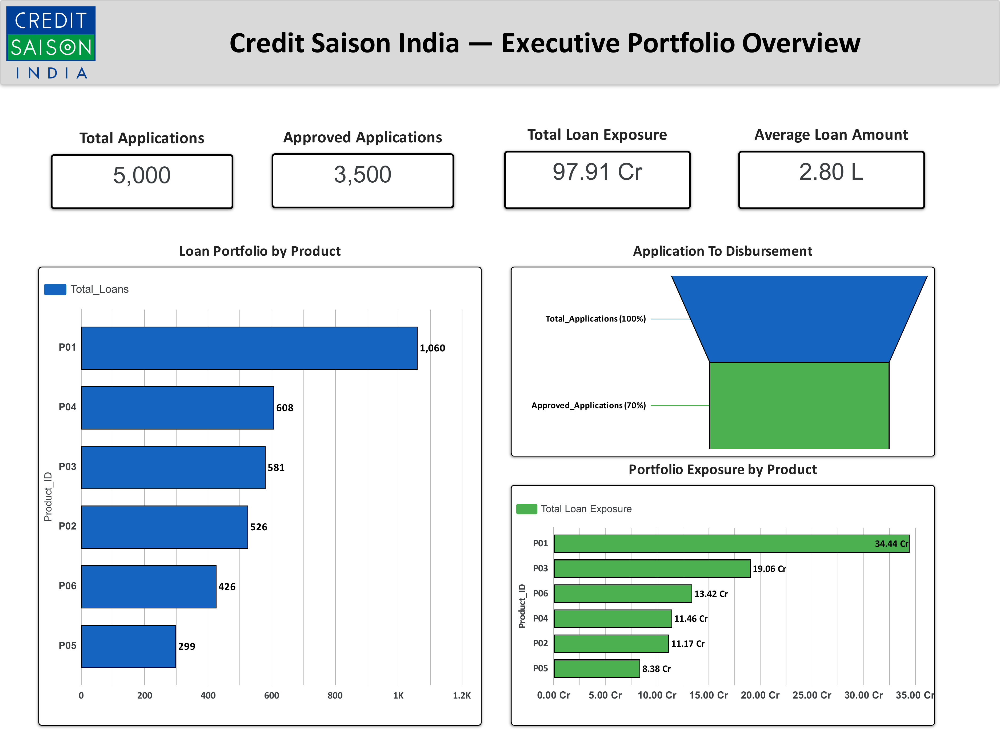
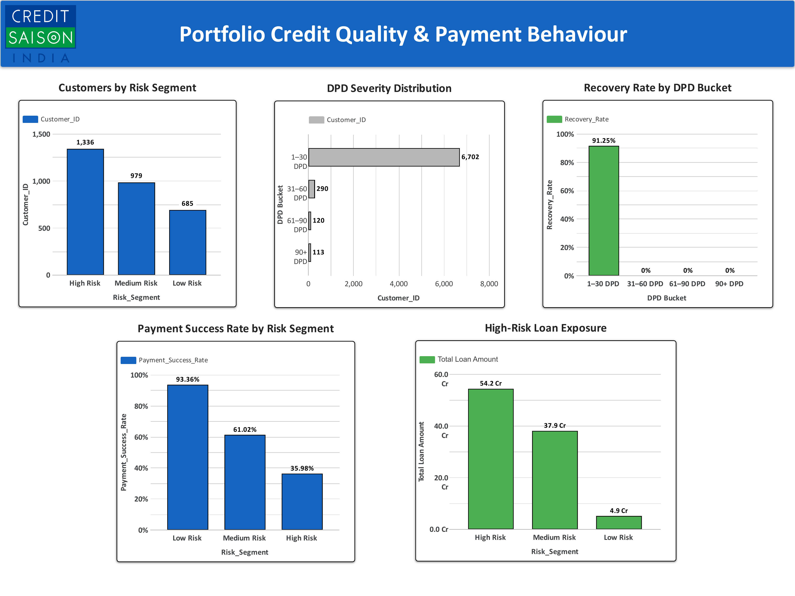
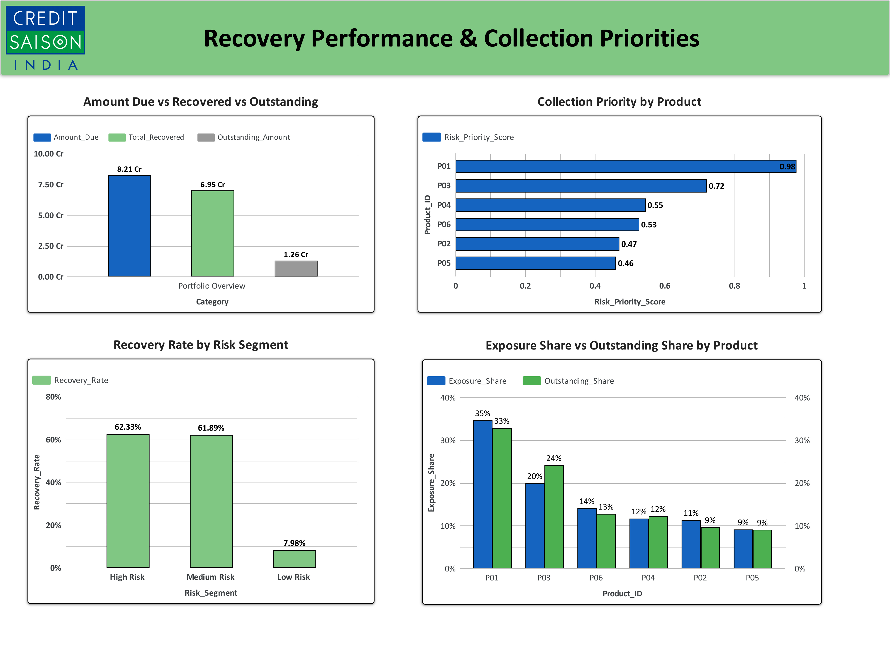

📊 NBFC Credit Risk & Portfolio Analytics

An end-to-end NBFC Credit Risk, Loan Portfolio & Collection Analytics project built using Microsoft Excel, Python (Pandas) and Looker Studio.

The project analyzes loan portfolio performance, credit risk segmentation, payment behaviour, delinquency (DPD), recovery performance and collection priorities to generate actionable business insights.

«Note: The dataset used in this project is synthetic/sample data created for portfolio and learning purposes and does not represent actual Credit Saison India customer or financial data.»

---

🎯 Business Problem

NBFCs need to continuously monitor their loan portfolio to understand:

- How much capital is exposed across the loan portfolio?
- Which customer segments carry higher credit risk?
- How does payment behaviour vary across risk segments?
- Which DPD buckets require greater collection attention?
- How much of the amount due has been recovered?
- Which products should receive higher collection priority?

This project was developed to answer these questions through structured data analysis and an interactive dashboard.

---

🎯 Project Objectives

- Analyze overall loan portfolio performance.
- Measure application and approval/disbursement trends.
- Evaluate portfolio exposure across products.
- Segment customers based on credit risk.
- Analyze payment success across risk segments.
- Analyze DPD severity and delinquency patterns.
- Measure recovery performance.
- Identify products requiring higher collection priority.
- Build an executive-level dashboard for business decision-making.

---

🛠️ Tools & Technologies

Tool| Purpose
Microsoft Excel| Data analysis, validation, calculations & KPI development
Python| Data processing, analytical calculations & automated analysis
Pandas| Data manipulation and analysis
Looker Studio| Interactive dashboard & visualization
GitHub| Project documentation & portfolio hosting

---

📂 Project Structure

NBFC-Credit-Risk-Portfolio-Analytics/
│
├── 📁 data/
│   └── NBFC_Loan_Portfolio_Credit_Risk_Analytics.xlsx
│
├── 📁 analysis/
│   ├── NBFC_Python_Analytics_Output.xlsx
│   └── nbfc_credit_risk_analysis.py
│
├── 📁 dashboard/
│   ├── dashboard_overview.jpg
│   ├── credit_risk_analysis.jpg
│   └── recovery_collection_analysis.jpg
│
└── README.md

---

🔄 Analytical Workflow

Raw Loan Portfolio Data
          ↓
     Excel Analysis
          ↓
   Data Validation &
   KPI Development
          ↓
     Python Analysis
          ↓
 Risk & Portfolio Analysis
          ↓
    Looker Studio
       Dashboard
          ↓
Business Insights &
Collection Priorities

---

📌 Portfolio Overview

The analyzed portfolio contains:

KPI| Value
Total Applications| 5,000
Approved Applications| 3,500
Total Loan Exposure| ₹97.91 Cr
Average Loan Amount| ₹2.80 L

The portfolio exposure is distributed across six products, with P01 contributing the largest exposure at ₹34.44 Cr.

---

📊 Dashboard

1. Executive Portfolio Overview

The first dashboard page provides a high-level view of:

- Total applications
- Approved applications
- Total loan exposure
- Average loan amount
- Loan portfolio by product
- Portfolio exposure by product
- Application-to-disbursement overview

---

2. Portfolio Credit Quality & Payment Behaviour

The second dashboard page focuses on portfolio credit quality and customer payment behaviour.

It includes:

- Customer risk segmentation
- DPD severity distribution
- Payment success rate by risk segment
- High-risk loan exposure
- Recovery rate by DPD bucket

The dashboard shows payment success rates of:

- Low Risk — 93.36%
- Medium Risk — 61.02%
- High Risk — 35.98%

High-risk customers represent ₹54.2 Cr of loan exposure.

---

3. Recovery Performance & Collection Priorities

The third dashboard page focuses on recovery and collection performance.

It includes:

- Amount due
- Total recovered
- Outstanding amount
- Recovery rate by risk segment
- Collection priority by product
- Exposure share vs outstanding share

The portfolio shows:

Collection KPI| Amount
Amount Due| ₹8.21 Cr
Total Recovered| ₹6.95 Cr
Outstanding Amount| ₹1.26 Cr

---

🔎 Key Business Insights

1. Portfolio Exposure Concentration

The portfolio has total loan exposure of ₹97.91 Cr, with P01 representing the largest product exposure at ₹34.44 Cr.

This indicates that product-level exposure concentration should be monitored when assessing portfolio risk.

2. High-Risk Segment Requires Attention

The high-risk customer segment contains 1,336 customers and represents ₹54.2 Cr in loan exposure.

This makes the high-risk segment an important area for portfolio monitoring and collection analysis.

3. Payment Behaviour Varies Significantly by Risk

Payment success declines considerably across risk segments:

93.36% → 61.02% → 35.98%

from Low Risk to Medium Risk to High Risk respectively.

This demonstrates a clear relationship between the project's risk segmentation and observed payment behaviour.

4. Recovery Performance

Against ₹8.21 Cr of amount due, ₹6.95 Cr has been recovered, leaving ₹1.26 Cr outstanding.

This provides a basis for monitoring collection effectiveness and identifying outstanding exposure.

5. Product-Level Collection Prioritization

The dashboard calculates a Risk Priority Score for each product to support collection prioritization.

P01 has the highest priority score at 0.98, followed by P03 at 0.72.

---

💡 Business Recommendations

Based on the analysis:

- Prioritize monitoring of high-risk customers with significant loan exposure.
- Strengthen collection strategies for segments with lower payment success.
- Monitor products with higher risk-priority scores.
- Track outstanding amounts alongside overall recovery performance.
- Use DPD buckets to identify accounts requiring different collection strategies.
- Monitor exposure concentration across products as part of portfolio risk management.

---

📈 Skills Demonstrated

Data Analytics

- Data cleaning & validation
- KPI development
- Portfolio analysis
- Credit risk analysis
- Delinquency analysis
- Recovery analysis
- Business insights

Excel

- Data validation
- Conditional logic
- KPI calculations
- Risk segmentation
- Portfolio analysis
- Collection analysis

Python

- Pandas
- Data processing
- Analytical calculations
- Automated reporting

Data Visualization

- Looker Studio
- KPI dashboards
- Risk segmentation visualizations
- Portfolio visualization
- Recovery & collection dashboards

Business Analysis

- Risk identification
- Portfolio monitoring
- Collection prioritization
- Management-oriented insights

---

🚀 Project Outcome

This project demonstrates an end-to-end analytics workflow where raw loan portfolio data is transformed into structured analysis, risk indicators, recovery metrics and an executive-level dashboard.

The final solution combines Excel + Python + Looker Studio to demonstrate both technical data-analysis capabilities and the ability to translate financial data into business insights.

---

👨‍💻 Author

Vedant Patil

Aspiring Data Analyst | Excel | SQL | Python | Power BI | Data Analytics

---

⭐ If you find this project useful, feel free to explore the analysis files and dashboard available in this repository.